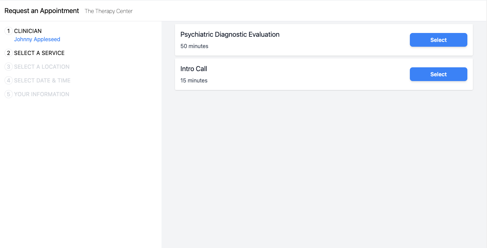
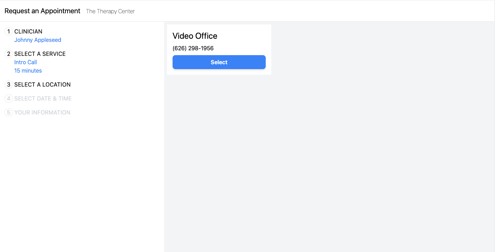

# scheduling-widget

## Configuration

To use the widget, you have to provide two configuration parameters:

1. Client portal base url (e.g. https://johnny-appleseed.clientsecure.me).
2. clinicianID (e.g 2).

There are two ways to provide the values:

1. Set the BASE_URL and CLINICIAN_ID env variables (see `.example.env` file, you can rename it to `.env` before starting
   the app).
2. Provide the clinicianId and baseUrl query params to the `/request` page (
   e.g. `/request?baseUrl=https%3A%2F%2Fjohnny-appleseed.clientsecure.me&clinicianId=2`). In this way, the widget can be
   placed on the doctor's website via iframe.

### Warning:

The query params will rewrite the environment variables.

## Screenshots

First Step

Second Step

## Prerequisites

You will need the following things properly installed on your computer.

- [Git](https://git-scm.com/)
- [Node.js](https://nodejs.org/) (with npm)
- [Ember CLI](https://ember-cli.com/)
- [Google Chrome](https://google.com/chrome/)

## Installation

- `git clone <repository-url>` this repository
- `cd scheduling-widget`
- `npm install`

## Running / Development

- `ember serve`
- Visit your app at [http://localhost:4200](http://localhost:4200).
- Visit your tests at [http://localhost:4200/tests](http://localhost:4200/tests).

### Code Generators

Make use of the many generators for code, try `ember help generate` for more details

### Running Tests

- `ember test`
- `ember test --server`

### Linting

- `npm run lint`
- `npm run lint:fix`

### Building

- `ember build` (development)
- `ember build --environment production` (production)

### Deploying

Specify what it takes to deploy your app.

## Further Reading / Useful Links

- [ember.js](https://emberjs.com/)
- [ember-cli](https://ember-cli.com/)
- Development Browser Extensions
  - [ember inspector for chrome](https://chrome.google.com/webstore/detail/ember-inspector/bmdblncegkenkacieihfhpjfppoconhi)
  - [ember inspector for firefox](https://addons.mozilla.org/en-US/firefox/addon/ember-inspector/)

?baseUrl=https%3A%2F%2Fjohnny-appleseed.clientsecure.me&clinicianId=2
